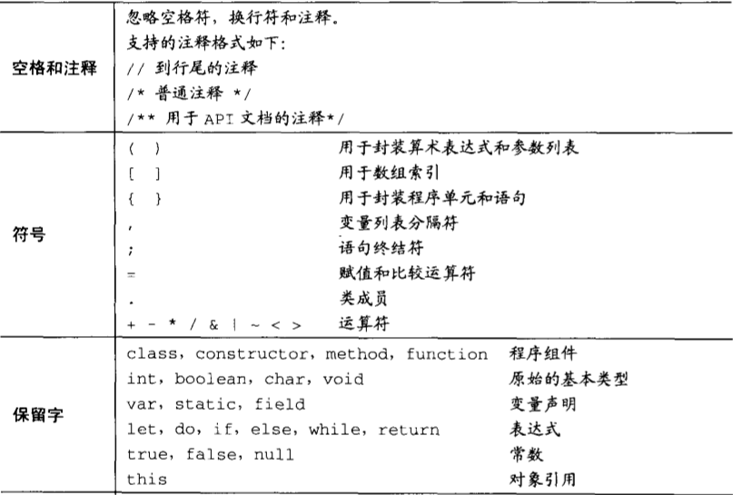
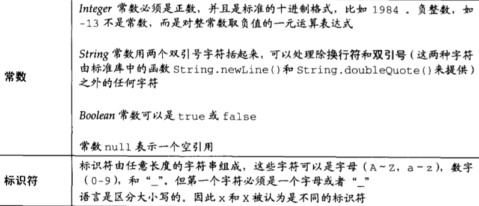
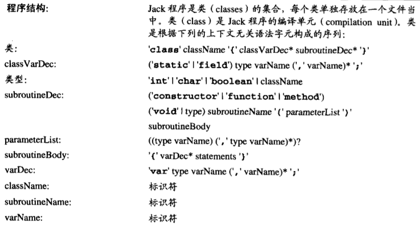
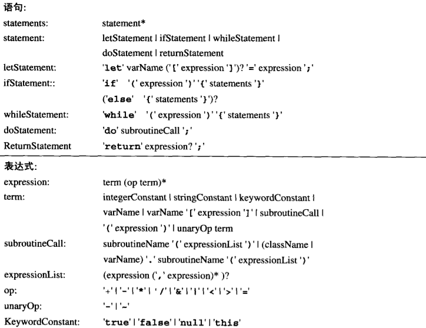
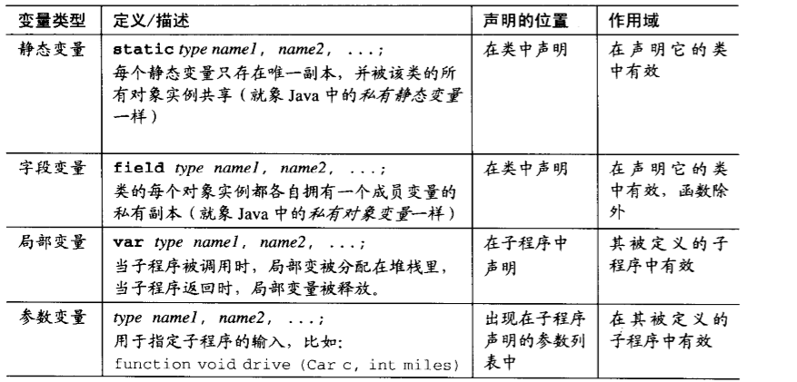
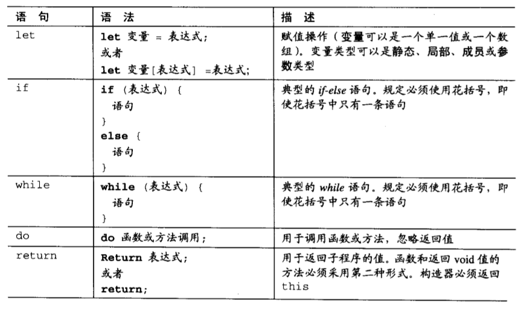
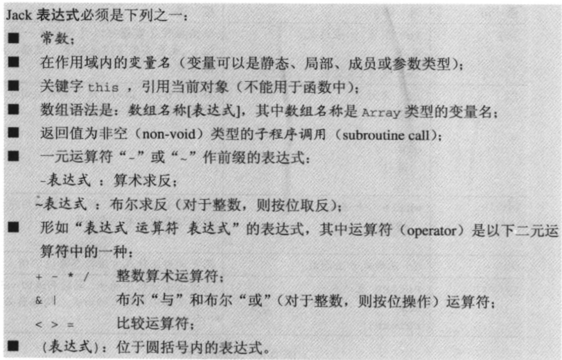

# jack语言（java实现）
jack 语言是我《计算机系统要素》这本书中学会的一门类java语言。
主要用来学习编译器的前端技术。   
这门语言特征是：  
* 面向对象：简单的面向对象语言，但暂时不支持继承。  
* 静态类型：支持int、long、float、double等基础数据类型。

### 词法单位 
 
 

### 语法单位
 
 

### 变量类型
 

### 语句类型
 
 
### 子程序类型
三种子程序  
* method：相当于 java 中的普通方法
* function：相当于 java 中的静态方法
* constructor：相当于 java 中的构造方法

### 表达式
 

### 构建和开发
获取 CompileCourse 文件夹后，可以基于源代码构建一个项目。或者使用IDEA打开原有.iml文件，使用IDEA项目。  
本项目我使用的是jdk 1.8_191版本开发

### 运行方法
在运行之前：
* 要设置好本机的java环境；     
* 想不通过IDEA而直接用命令行命令执行，请设置好CLASSPATH,让java能够找到该项目中的类。    
* 使用命令行工具，执行 java REPL, 这将启动一个REPL界面，在里面输入源码,或者直接赋值测试文件下的源码，并解释执行。   
* 使用IDEA工具，直接在IDEA项目中打开 REPL.java 然后点击run按钮启动一个REPL界面。
* 当然还有其他几个类（Parser, Tokenizer）中有 main 函数可以运行进行单独测试，路径在下面

### 项目中主要的示例代码
* [REPL.java](src/REPL.java) 解释器。
* [Parser.java](src/Parser.java) 语法分析器
* [Tokenizer.java](src/Tokenizer.java) 分词器
* [type](src/type) 包含 token 类型和 AST结点 类型
* [node](src/node) 包含 token 和 AST结点 

---
## 注意
该目录下的代码会随时更新。
